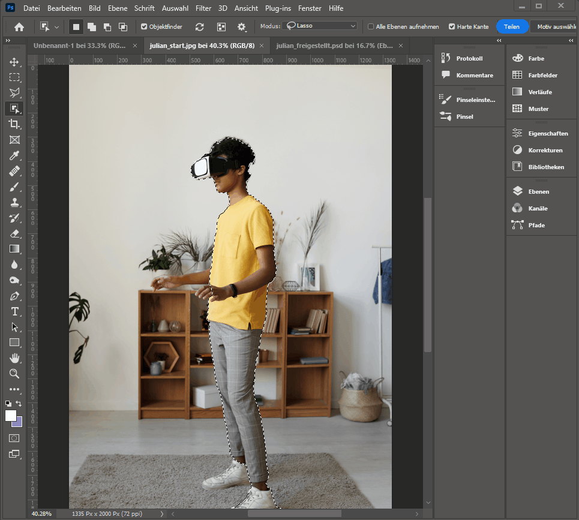

= Poster Tutorial
Cla Tschenett <cla.tschenett@ibw.ch>
1.0 - 19.02.2023
:toc:
:toc-title: Inhaltsverzeichnis
:icons: font
:url-quickref: https://docs.asciidoctor.org/asciidoc/latest/syntax-quick-reference/

== Neues Dokument erstellen
für diese Übung erstellen wir ein neues Dokument mit 300x300mm und 300ppi

image::images/new_document.png[]

== Bild herunterladen

https://www.pexels.com/photo/photo-of-boy-using-vr-headset-4144098/[Bild herunterladen und im Photoshop öffnen]

Als erstes musst du das Objekt welches du freistellen möchtest auswählen. Dies kann z.B. mit dem `Objektauswahlwerkzeug (W)` gemacht werden.

image::images/select.gif[]

Das Objekt wird ausgewählt, allerdings ist es gut möglich, dass Photoshop dies nicht perfekt macht (weil es sehr vom Hintergrund abhängt).

In diesem Beispiel fhelt ein Schuh sowie die rechte Hand.

== Maske erstellen

Um die Auswahl zu bearbeiten, kann eine Maske unter Ebenen erstellt werden.

Die Ebene hat nun zusätzlich eine Maske welche bearbeitet werden kann. Schwarz bedeutet, dass die Pixel maskiert sind, also "versteckt" und weiss, dass die Pixel sichtbar sind.

image::../Tutorial Rainbow/images/mask[]

Dies bedeutet, dass die Maske mit dem `Pinselwerkzeug (B)` bearbeitet werden kann.

