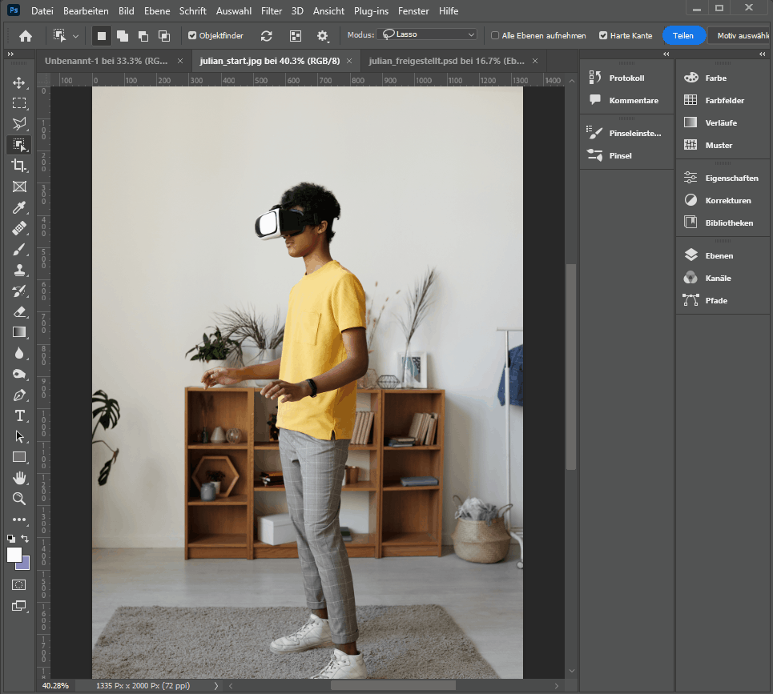

= Rainbow Tutorial
Cla Tschenett <cla.tschenett@ibw.ch>
1.0 - 19.02.2023
:toc:
:toc-title: Inhaltsverzeichnis
:icons: font
:url-quickref: https://docs.asciidoctor.org/asciidoc/latest/syntax-quick-reference/

== Neues Dokument erstellen
für diese Übung erstellen wir ein neues Dokument mit 300x300mm und 300ppi

image::images/new_document.png[]

== Bild herunterladen

https://www.pexels.com/photo/photo-of-boy-using-vr-headset-4144098/[Bild herunterladen und im Photoshop öffnen]

